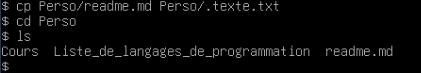
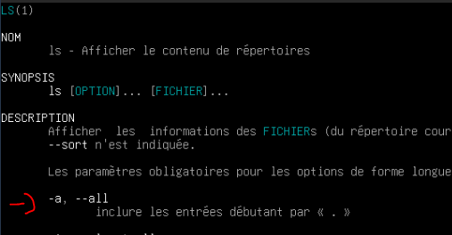
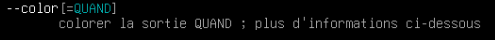
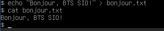

# TP2 Options et Entrée/Sorties
## Partie II : Les options
### Question 1

Ici la commande utiliser afin de copier les repertoire et sous répertoire es:

```bash
cp -r Cours Perso
```

### Question 2
```bash
cp Perso/readme.md Perso/.texte.txt
```

### Question 3
```bash
cd Perso
ls
```
On voit `Cours`, `readme.md` et `Liste_de_langages_de_programmataion` mais pas `.texte.txt` car les fichiers dont le nom commence par un point sont cacher

Comme nous le voyont sur cette image les fichier commençant par un `.` ne sont pas affihcer



### Question 4

```bash
ls -a Perso
```
(ou `ls --all` marche aussi)



### Question 5

```bash
ls --color Perso
```


### Question 6 

```bash
rm -r Perso/Cours
```

### Question 7
```bash
rm -i
```

## Partie III : Les entrées/sorties

Avant de debuter cette partie comme indiquer dans le TP nous allon cree le répertoire `IO`

```bash
mkdir IO
cd IO
```

### Question 8

```bash
echo "Bonjour, BTS SIO !" > bonjour.txt
cat bonjour.txt
```


### Question 9